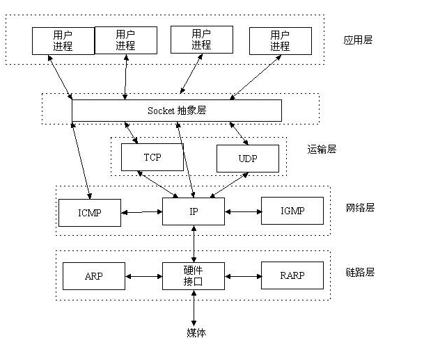

# HTTP 协议

HTTP = HyperText Transfer Protocol, 是网络中的应用层协议， http 是建立在 TCP 协议之上的
**此处需要了解下 ISO 七层模型**
ISO 于 1978 年开发的一套标准架构 ISO 模型，被引用来说明数据通信协议的结构和功能。

OSI 在功能上可以划分为两组：

- 网络群组：物理层、数据链路层、网络层

- 使用者群组：传输层、会话层、表示层、应用层

- OSI:

* 物理层：EIA/TIA-232, EIA/TIA-499, V.35, V.24, RJ45, Ethernet, 802.3, 802.5, FDDI, NRZI, NRZ, B8ZS
* 数据链路层：Frame Relay, HDLC, PPP, IEEE 802.3/802.2, FDDI, ATM, IEEE 802.5/802.2
* 网络层：IP，IPX，AppleTalk DDP
* 传输层：TCP，UDP，SPX
* 会话层：RPC,SQL,NFS,NetBIOS,names,AppleTalk,ASP,DECnet,SCP
* 表示层:TIFF,GIF,JPEG,PICT,ASCII,EBCDIC,encryption,MPEG,MIDI,HTML
* 应用层：FTP,WWW,Telnet,NFS,SMTP,Gateway,SNMP

**容易混淆概念**
SSH： SSH 为 Secure Shell 的缩写，由 IETF 的网络小组（Network Working Group）所制定；SSH 为建立在应用层基础上的安全协议。来自百科复制，个人理解是应用层，在 ENSP 上测试，过滤 TCP 的 SYN 头部的包无法通信 SSH，所以需要依赖传输层 TCP 封装, TCP 的上面一层
Socket: 套接字（socket）是通信的基石，是支持 TCP/IP 协议的网络通信的基本操作单元。它是网络通信过程中端点的抽象表示，包含进行网络通信必须的五种信息：连接使用的协议， 本地主机的 IP 地址，本地进程的协议端口， 远地主机的 IP 地址，远地进程的协议端口。


**HTTP 进化**

- 1）在 HTTP 1.0 中，客户端的每次请求都要求建立一次单独的连接，在处理完本次请求后，就自动释放连接。

- 2）在 HTTP 1.1 中则可以在一次连接中处理多个请求，并且多个请求可以重叠进行，不需要等待一个请求结束后再发送下一个请求。
- 3）网景 1994 年创建了 HTTPS，最初，HTTPS 是与 SSL 一起使用的；在 SSL 逐渐演变到 TLS 时（其实两个是一个东西，只是名字不同而已），最新的 HTTPS 也由在 2000 年五月公布的 RFC 2818 正式确定下来。简单来说，HTTPS 就是安全版的 HTTP，并且由于当今时代对安全性要求更高，chrome 和 firefox 都大力支持网站使用 HTTPS，苹果也在 ios 10 系统中强制 app 使用 HTTPS 来传输数据，由此可见 HTTPS 势在必行。

**HTTP1.0 vs HTTP1.1**
HTTP1.0 最早在网页中使用是在 1996 年，那个时候只是使用一些较为简单的网页上和网络请求上，而 HTTP1.1 则在 1999 年才开始广泛应用于现在的各大浏览器网络请求中，同时 HTTP1.1 也是当前使用最为广泛的 HTTP 协议。区别：

- 缓存处理，在 HTTP1.0 中主要使用 header 里的 If-Modified-Since,Expires 来做为缓存判断的标准，HTTP1.1 则引入了更多的缓存控制策略例如 Entity tag，If-Unmodified-Since, If-Match, If-None-Match 等更多可供选择的缓存头来控制缓存策略。
- 带宽优化及网络连接的使用，HTTP1.0 中，存在一些浪费带宽的现象，例如客户端只是需要某个对象的一部分，而服务器却将整个对象送过来了，并且不支持断点续传功能，HTTP1.1 则在请求头引入了 range 头域，它允许只请求资源的某个部分，即返回码是 206（Partial Content），这样就方便了开发者自由的选择以便于充分利用带宽和连接。
  错误通知的管理，在 HTTP1.1 中新增了 24 个错误状态响应码，如 409（Conflict）表示请求的资源与资源的当前状态发生冲突；410（Gone）表示服务器上的某个资源被永久性的删除。
- Host 头处理，在 HTTP1.0 中认为每台服务器都绑定一个唯一的 IP 地址，因此，请求消息中的 URL 并没有传递主机名（hostname）。但随着虚拟主机技术的发展，在一台物理服务器上可以存在多个虚拟主机（Multi-homed Web Servers），并且它们共享一个 IP 地址。HTTP1.1 的请求消息和响应消息都应支持 Host 头域，且请求消息中如果没有 Host 头域会报告一个错误（400 Bad Request）。
- 长连接，HTTP 1.1 支持长连接（PersistentConnection）和请求的流水线（Pipelining）处理，在一个 TCP 连接上可以传送多个 HTTP 请求和响应，减少了建立和关闭连接的消耗和延迟，在 HTTP1.1 中默认开启 Connection： keep-alive，一定程度上弥补了 HTTP1.0 每次请求都要创建连接的缺点

**HTTPS vs HTTP**

- HTTPS 协议需要到 CA 申请证书，一般免费证书很少，需要交费。
- HTTP 协议运行在 TCP 之上，所有传输的内容都是明文，HTTPS 运行在 SSL/TLS 之上，SSL/TLS 运行在 TCP 之上，所有传输的内容都经过加密的。
- HTTP 和 HTTPS 使用的是完全不同的连接方式，用的端口也不一样，前者是 80，后者是 443。
- HTTPS 可以有效的防止运营商劫持，解决了防劫持的一个大问题。

**检测网站使用协议**

```console
curl -i websitename
```

**升级网站为 HTTPS**
安装 CA 证书，一般的证书都是需要收费的，这边推荐一个比较好的购买证书网站：1）Let's Encrypt，免费，快捷，支持多域名（不是通配符），三条命令即时签署+导出证书。缺点是暂时只有三个月有效期，到期需续签。2Comodo PositiveSSL，收费，但是比较稳定。
在购买证书之后，在证书提供的网站上配置自己的域名，将证书下载下来之后，配置自己的 web 服务器，同时进行代码改造。
HTTPS 降低用户访问速度。SSL 握手，HTTPS 对速度会有一定程度的降低，但是只要经过合理优化和部署，HTTPS 对速度的影响完全可以接受。在很多场景下，HTTPS 速度完全不逊于 HTTP，如果使用 SPDY，HTTPS 的速度甚至还要比 HTTP 快。
相对于 HTTPS 降低访问速度，其实更需要关心的是服务器端的 CPU 压力，HTTPS 中大量的密钥算法计算，会消耗大量的 CPU 资源，只有足够的优化，HTTPS 的机器成本才不会明显增加。

**延伸阅读**
[淘宝改造为 https](http://velocity.oreilly.com.cn/2015/ppts/lizhenyu.pdf)

1. 尽可能降低 TLS 新建的⽐率
2. 使⽤ ECC 算法，ECDSA 证书需要 CA ⽀持
3. 使⽤最新内核、Webserver、OpenSSL 的稳定版本
4. 建⽴性能监控，找到 HTTPS 的性能瓶颈
5. SPDY3.1&HTTP/2 对⽤户体验提升最⼤
6. HTTP/1.1 的最佳实践在 HTTP/2 可能不再适⽤
7. ⻩三⾓和盾牌⼀定需要去除
8. 使⽤多证书解决 Chrome 将 SHA1 标记为⻩⾊的问题
9. 多泛域名证书能极⼤的降低运维成本
   10.HSTS ⼀定要⽀持 11.使⽤//同时提供 http&https 的服务 12.经常使⽤ ssllabs 等⺴站检测 TLS 配置
