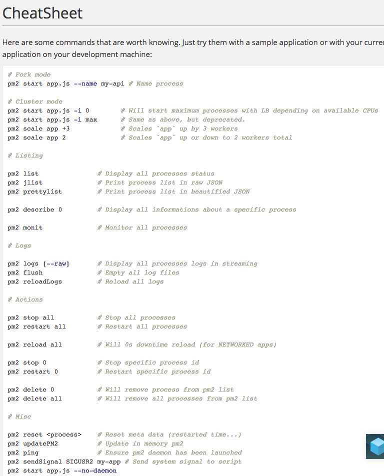

# Server 服务器

抢购百度云，108 玩一年

# 目标

- 业务目标： 十点问候老王
- 技术目标： 熟悉 nodejs

# 架构设计

- 语言： javascript
- Frontend： Reactjs 如果需要页面的话
- Backend： Nodejs，暂时不用框架，无框架比较方便学习
- 数据库： MongoDB

# 产品设计

- 第一版，没有页面， hard code 一个发送时间点

# 视线

**环境**
\_ 操作系统 SUSE
**安装 node**
SUSE 操作系统的包管理器为 zypper， 跟 mac homebrew 类似

```console
zypper install node
```

**github 作为版本控制工具**
在 github 创建空项目

```console
git clone githubproject_url
git init
```

**定时管理**
使用已有工具[Node Schedule](https://www.npmjs.com/package/node-schedule)

```console
 npm install node-schedule --save
```

定时一般使用[Cron Job](https://www.ostechnix.com/a-beginners-guide-to-cron-jobs/),

> Cron is one of the most useful utility that you can find in any Unix-like operating system. It is used to schedule commands at a specific time. These scheduled commands or tasks are known as “Cron Jobs”. Cron is generally used for running scheduled backups, monitoring disk space, deleting files (for example log files) periodically which are no longer required, running system maintenance tasks and a lot more. In this brief guide, we will see the basic usage of Cron Jobs in Linux.

**邮件发送**
使用已有工具[nodemailer](https://github.com/nodemailer/nodemailer)

```javascript
var transporter = nodemailer.createTransport({
  service: "163",
  auth: {
    user: "",
    pass: ""
  }
});

var mailOptions = {
  from: "",
  to: "",
  subject: "什么时候下班？！！！",
  text: "现在可以打车了，早点下班鸭！"
};
transporter.sendMail(mailOptions, function(error, info) {
  if (error) {
    console.log(error);
  } else {
    console.log("Email sent: " + info.response);
  }
});
```

**发布到 server**
简单的代码编写完毕之后，只需要再 server 上跑起来，通常做法是：

```console
  node run index.js
  supervisor index
```

[supervisor](https://www.npmjs.com/package/supervisor) 是一个常用的运行，监控 nodejs 变化的工具，跟 nodemon，forever 类似,是热部署工具
[supervisor, nodemon, forever 比较](https://www.npmtrends.com/forever-vs-nodemon-vs-supervisor)

- 缺点
  当 terminal 关闭的时候这个进程也会关闭，node 项目就会关掉
  _solution_

* nohup node run index.js 在后台跑 node 项目
* 使用[pm2](http://pm2.keymetrics.io/) node 进程管理工具

```console
pm2 start index.js
```


